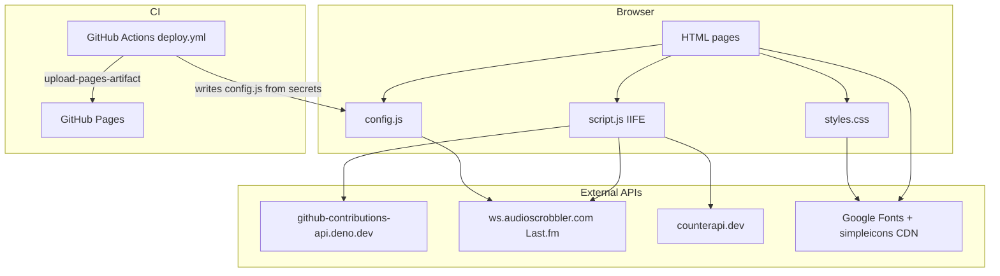

# Architecture Notes — Portfolio v2

This document describes how the site is built, how data flows, and where the main trade-offs are. It is written for someone reading the repo for the first time.

## System type

**Static multi-page site (MPA)** — no Node server, no React, no build step in the repo.

| Layer | Technology |
|-------|------------|
| Markup | HTML5 (4 content pages + `404.html`) |
| Style | Single `styles.css` (~670 lines), CSS variables, `html.dark` class |
| Behavior | Single `script.js` (~387 lines), one IIFE |
| Config | `config.js` (gitignored locally; generated in CI) |
| Hosting | GitHub Pages via `.github/workflows/deploy.yml` |
| Assets | `assets/` (images; not listed in glob but referenced by HTML) |

There is **no `package.json`**. Dependencies are browser `fetch()` calls to third-party HTTP APIs and CDN image/font URLs.

## Repository map

```
portfolio 2/
├── index.html          # Home: profile, Last.fm, heatmap, experience, education
├── projects.html       # Static project list (timeline markup)
├── blogs.html          # Placeholder “coming soon”
├── research.html       # Placeholder “coming soon”
├── 404.html            # Custom 404 (minimal inline JS only)
├── styles.css          # All visual design
├── script.js           # All interactive behavior
├── config.example.js   # Template for local Last.fm keys
├── config.js           # Real keys (local + CI-generated; .gitignore)
├── assets/             # Images (avatar, logos, album fallback)
└── .github/workflows/deploy.yml
```

## High-level diagram



## Page responsibilities

| File | Dynamic features | Notes |
|------|------------------|-------|
| `index.html` | Heatmap, Last.fm, view counter, full `script.js` | Richest page |
| `projects.html` | Theme, palette, pet, cursor; heatmap/Last.fm DOM absent → those blocks no-op | No mobile menu button in header (inconsistency) |
| `blogs.html` | Same as projects | Static placeholder content |
| `research.html` | Same as projects | Static placeholder content |
| `404.html` | Theme + pet only | Does not load `script.js` |

## `script.js` module map (logical, not separate files)

Everything runs inside one IIFE starting at line 2.

| Lines (approx) | Concern | DOM / globals |
|----------------|---------|----------------|
| 2–13 | Theme init + toggle | `localStorage.theme`, `[data-theme-toggle]`, `html.dark` |
| 18–198 | GitHub contribution heatmap | `#heatCells`, `#heatTotal`, `#heatStreak` |
| 199–239 | Last.fm “now playing” | `.spotify`, global `CONFIG` |
| 241–274 | Visitor counter | `#viewCount` |
| 276–289 | Scroll fade-in | `section.block`, `IntersectionObserver` |
| 291–295 | Mobile nav | `#mainNav`, `toggleMobileMenu()` |
| 297–442 | Command palette | `#commandPalette`, `openPalette()`, `handleAction()` |
| 444–453 | Pixel pet | `petMeow()` |
| 455–474 | Custom cursor | `.custom-cursor` |

## Data flows

### 1. Theme

1. On load: read `localStorage.getItem('theme')`.
2. If unset, use `prefers-color-scheme: dark`.
3. Toggle button flips `document.documentElement.classList` and persists `'dark'` or `'light'`.

CSS uses `html.dark { --background: ... }` in `styles.css` (lines 22–38).

### 2. GitHub heatmap

1. `fetch('https://github-contributions-api.deno.dev/aspartic-gthb.json')`
2. Map API `contributionLevel` strings → integers 0–4.
3. Build 53×7 grid; `renderHeatmap()` writes cell divs.
4. On failure: `fallbackLevel(w,d)` pseudo-random pattern (looks real but is fake).

**Why a third-party API:** GitHub has no official public “contributions JSON” for arbitrary sites without auth. This Deno-hosted proxy is a common shortcut for portfolios.

### 3. Last.fm widget

1. Requires `CONFIG.LASTFM_USER` and `CONFIG.LASTFM_API_KEY` from `config.js`.
2. `user.getrecenttracks` with `limit=1`.
3. Updates `.spotify` title, artist/album, album art; toggles “Now spinning” vs “Recently played”.

**Security note:** The API key is shipped to every visitor’s browser. Last.fm keys are often treated as “public” for read-only scrobbling widgets, but they can still be abused for quota/rate limits. A production hardening path is a tiny serverless proxy that holds the secret.

### 4. Visitor counter

1. `GET https://api.counterapi.dev/v1/aspartic-portfolio/main-visits/up` — **increments** on every home page load.
2. Animates display from `count - 20` to `count`.
3. On error: synthetic number from days since 2026-01-01.

This is a **visit counter**, not a passive “total views” read — refreshing the page increases the count.

### 5. Command palette

1. `Ctrl+K` / `Cmd+K` → `openPalette()`.
2. Filter `.cm-item` nodes by text; arrow keys + Enter; single-letter shortcuts when input empty.
3. `handleAction()` navigates or triggers theme/copy/scroll.

Palette markup is **duplicated in full** on each HTML file (~80 lines × 4 pages).

## Deployment pipeline

`.github/workflows/deploy.yml`:

1. Trigger: push to `main` or manual `workflow_dispatch`.
2. Echo `config.js` from `secrets.LASTFM_API_KEY` and `secrets.LASTFM_USER`.
3. Upload entire repo root as Pages artifact (no bundler, no minification).
4. `deploy-pages@v4` publishes.

`config.js` exists only on the deployed site (and locally); it is in `.gitignore`.

## Styling architecture

- **Design tokens:** `:root` and `html.dark` CSS variables (`oklch` colors).
- **Layout:** `.shell` max-width 48rem, `.frame` bordered column, decorative `.side-rail` / `.band-grid`.
- **Components:** BEM-ish class names (`.heat-cell`, `.cm-item`, `.tl-content`) but no component files.
- **Responsive:** Mobile nav hidden until `.nav.open`; command palette hint hidden on small screens.

## Known structural debt

1. **Copy-paste HTML** — header, footer, command palette, pixel pet repeated per page.
2. **Monolithic `script.js`** — all features run on every page that includes the script; guards (`if (cells && months)`) prevent errors but waste work.
3. **Misleading names** — `.spotify` class and comments refer to Spotify; integration is Last.fm.
4. **404 split brain** — duplicates theme/pet logic inline instead of sharing `script.js`.
5. **Hardcoded identity** — GitHub username, CounterAPI namespace, email, resume URL in JS/HTML.
6. **No content layer** — projects/experience are hand-edited HTML, not JSON/Markdown.

## Suggested target architecture (future)

```
src/
  partials/       # header, footer, palette (templated)
  data/
    projects.json
    experience.json
  js/
    theme.js
    heatmap.js
    lastfm.js
    command-palette.js
  css/
    tokens.css
    components.css
```

Build with **Eleventy**, **Astro**, or **Vite + vanilla** to deduplicate markup and optionally proxy Last.fm.

## Files safe to ignore when learning

- `.gitignore`, IDE folders
- `config.js` until you need Last.fm locally (use `config.example.js`)
- Placeholder pages’ inline `style=` on coming-soon boxes (one-off, not pattern)

## Study order

1. `index.html` structure (sections and IDs)
2. `styles.css` `:root` + `.profile` + `.heat-*`
3. `script.js` theme block, then heatmap, then Last.fm
4. `deploy.yml` + `config.example.js`
5. Compare `projects.html` vs `index.html` duplication
